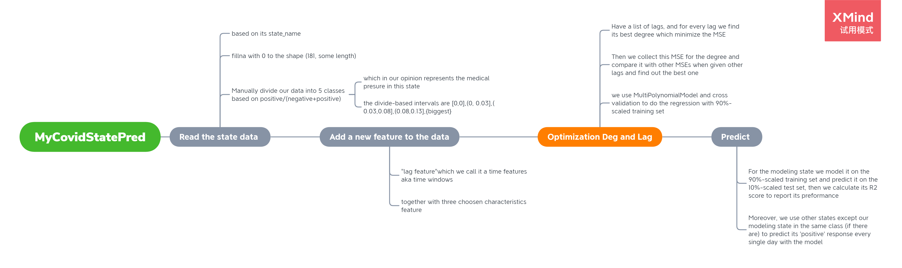

# US_state_daily_Covid_19 .py #

## Organization of my codes ##
> The following are organized in its operation order:

##### PlotPredict(df, state_name_modeling, state_name_predicting, class_name, my_figsize=(10, 6), option=0)
+ Plot our data with my choosen `option` and `state_name_modeling` to get the model, `state_name_predicting` to use the model to predict
+ It is the upper function

##### Operations(df, state_name)
+ Use this function to operate PolynomialRegMinLag, returning MinLag and MinDeg then up to PolynomialRegPredict
+ It also returns the model for other `state_name_predicting` except `state_name_modeling` if there exists with `option` to be 1 to show the whole predict on every single day
+ It is stacked in *PlotPredict*

##### PolynomialRegMinLag (df, itrain, itest, state_name, n_folds=4, mindeg=3)
+ Use this function as an optimal process, returning my **MinLag** and **MinDeg** (In fact, we have a list of lags, and for every **lag** we find its best degree which minimize the *MSE*, and then we collect this *MSE* for the degree and compare it with other *MSEs* when given other lags and find out the best one, that is where our **MinLag** and **MinDeg** come from)
+ It is stacked in O*perations*

##### PolynomialRegPredict(df, itrain, itest, state_name, n_folds=4, mindeg=3, minlag=5)
+ Use the **MinLag** and **MinDeg** to work the predictions out on test set
+ It is stacked in *Operations*

##### PolynomialRegMinDeg(df, itrain, itest, state_name, n_folds=4, lag=5)
+ Use this function as the first optimal process of PolynomialRegMinLag, when given a certain lag we return a list of MSEs corresponding to every degree, as well as **MinDeg** for the given lag
+ It is stacked in *PolynomialRegMinLag*

##### CookDataFrame(df, state_name, lag=5)
+ Add our **characteristics features ** and **time features**(because this is a time-series issue)
+ Reshape x and y
+ It is stacked in *PolynomialRegMinDeg*

## Libaries ##
+ Pandas

+ Numpy

+ matplotlib

+ seaborn

+ sklearn

## Procedure ##
> The Flow chart is shown below

## Specific environment configurations ##
> What I used is based on the following environment

+ pd.__version__		1.0.1

+ sklearn.__version__		0.22.1

+ matplotlib.__version__	3.1.3

+ sns.__version__		0.10.0

+ np.__version__		1.18.1

+ python.__version__		2.7.6